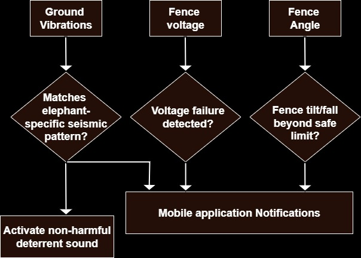
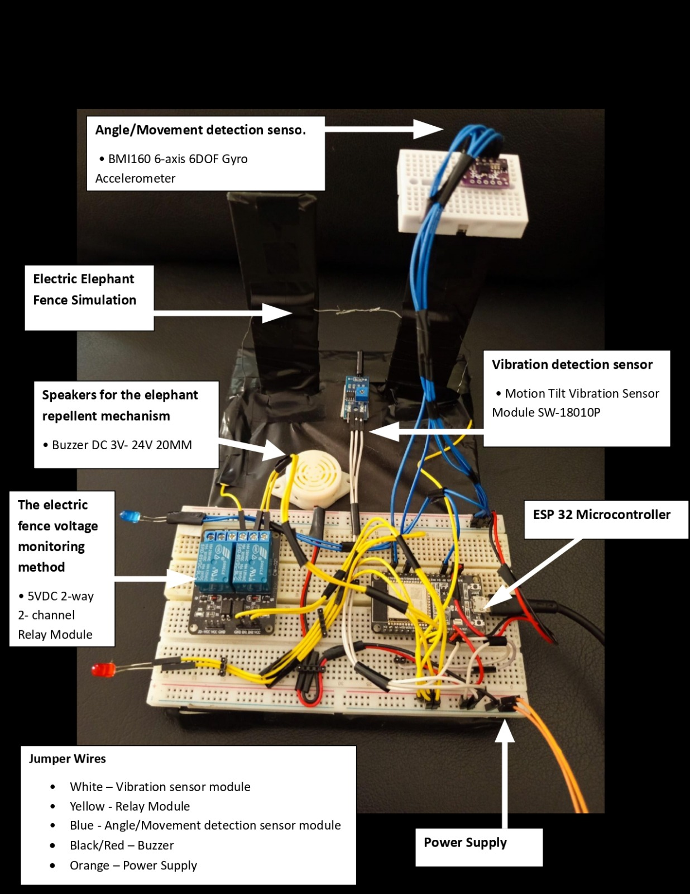
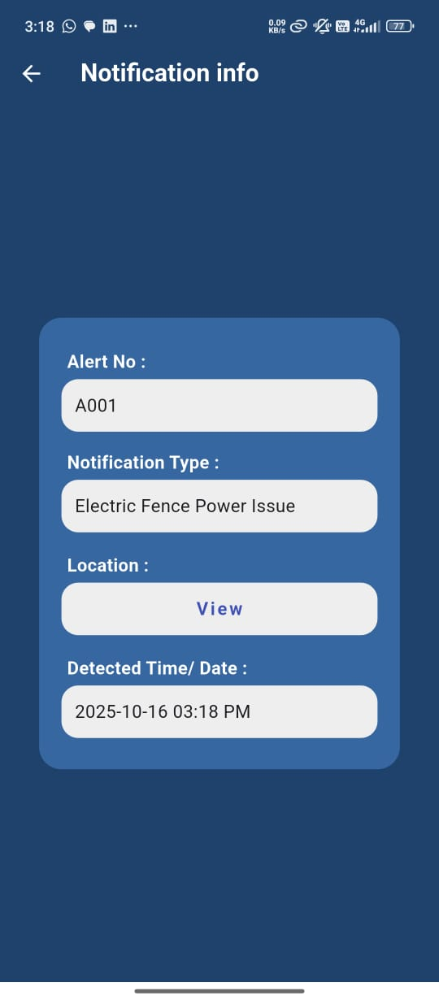
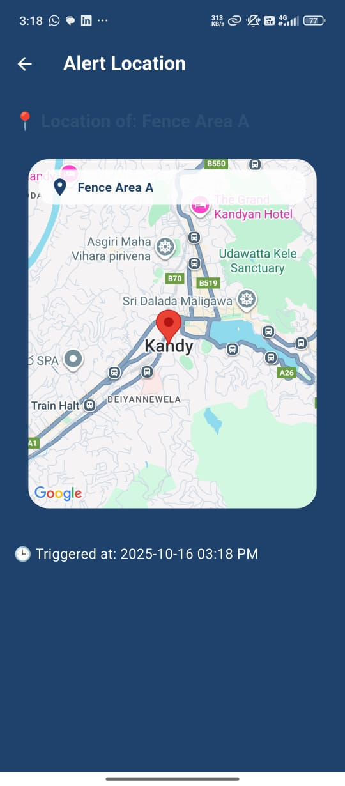
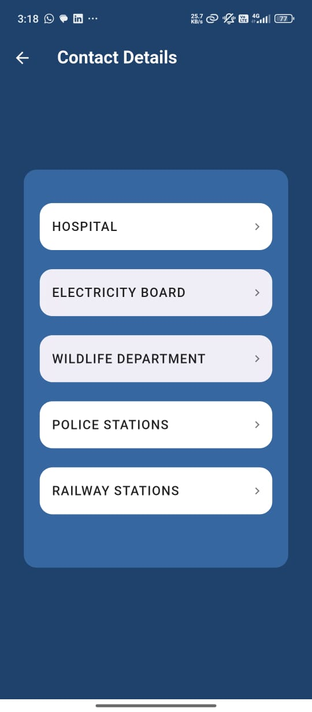
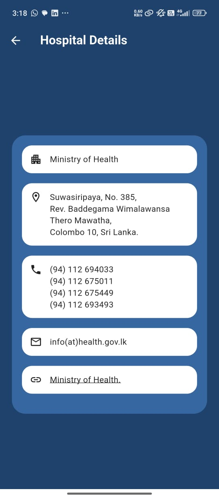
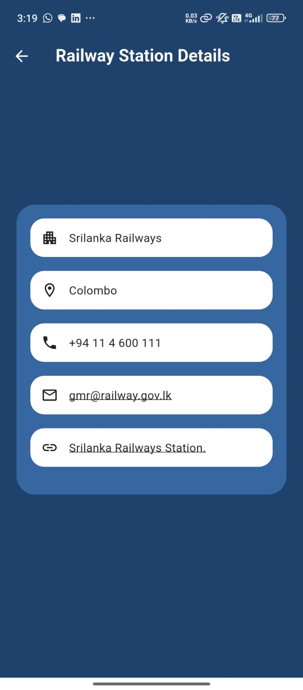
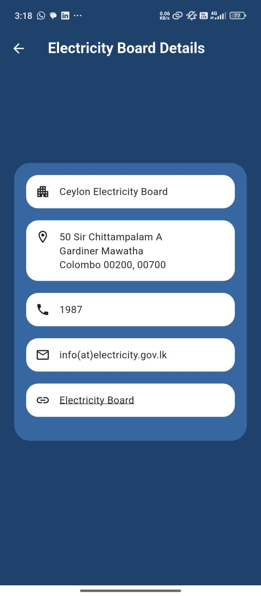
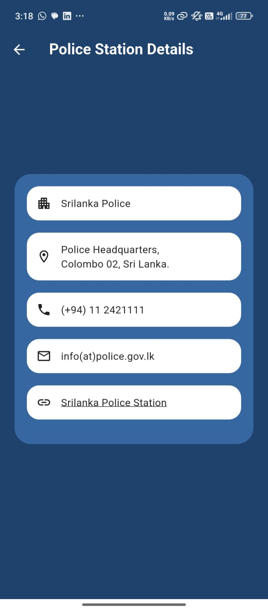

# 🐘 EleFence360 – Automated Elephant Detection, Deterrence, and Monitoring System for enhanced elephant fencing

**EleFence360** is an intelligent IoT-based solution to detect and deter elephants, monitor elephant electric fences, and enhance awareness among people and relevant authorities. The system integrates **IoT, sensor technology, and a mobile application** to reduce human-elephant conflict, property damage, and Loss of lives.

Project Video - https://youtu.be/BJ5XGb5v0k8 
---

## 🚀System Workflow

Human-elephant conflict (HEC) is a significant issue in many rural areas, often leading to crop destruction, infrastructure damage, and even loss of life for both humans and elephants.

**EleFence360** provides a **real-time monitoring and alert system** that:  

- Detects elephant movements near electric fences  
- Monitors fence integrity  
- Immediately notifies relevant authorities and villagers through a mobile app  

**System Methodology:**  
**Detection → Deterrence → Monitoring → Real-time Data Communication**

### **Detection**
- Ground vibrations (indicating elephant movement)  
- Electric fence voltage status (detecting power loss or failure)  
- Fence post tilts or movements (possible intrusion points)  

### **Deterrence**
- **Sound Deterrence:** Activates non-harmful repellent sounds to repel elephants  

### **Monitoring & Real-Time Data Communication**
Once a threat is detected, real-time alerts are sent to stakeholders via the mobile app, including:  

- Local villagers  
- Wildlife department  
- Electricity board  
- Nearest railway station  

Each alert contains the **incident-triggered time, date, and actual location** (Google Maps), displaying threat areas on the app map interface.

---

## ⚙️ System Architecture

**EleFence360** consists of **three integrated layers**:

### 1. Hardware Layer (IoT Unit)
- **Microcontroller:** ESP32 (with integrated WiFi module)  
- **Sensors Used:**  
  - Vibration sensors – detect ground vibrations caused by elephant movement  
  - Relay module – monitors electric fence power status  
  - Gyro-accelerometer – detects fence post displacement  
- **Actuators:**  
  - Buzzer/speaker for sound deterrence
  - LED Bulbs indicating each incident

The ESP32 reads real-time sensor data and transmits it to **Firebase Realtime Database** via WiFi.

### 2. Database Layer
**Firebase Realtime Database** is used for:  
- Storing live sensor readings  
- Triggering alerts to the mobile app  
- Synchronizing data across devices  
- Storing static location data  

### 3. Mobile Application (User Interface)
- **Built using:** Flutter  
- **Key Pages:**  
  - Login Page  
  - Registration Page  
  - Home Page  
  - Notifications Page  
  - Notification Details  
  - Live Location Page  
  - Contact Details Page  

---

## 🧠 Core Functionalities

| Functionality           | Description |
|-------------------------|-------------|
| Vibration Detection     | Detects elephant footstep vibrations through sensors. |
| Fence Power Monitoring  | Ensures the electric fence is active; detects voltage drop or power loss. |
| Fence Damage Detection  | Identifies physical fence post tampering or tilting. |
| Sound Deterrence        | Activates non-harmful sound to repel elephants. |
| Real-Time Alerts        | Sends instant notifications to app users and authorities. |
| Location Tracking       | Displays threat areas on the map in the app interface. |

---

## 🛠️ Technologies Used

| Component                | Technology |
|--------------------------|------------|
| Microcontroller          | ESP32 |
| Connectivity             | ESP32 integrated WiFi Module |
| Backend / Database       | Firebase Realtime Database |
| Frontend (Mobile App)    | Flutter |
| Programming Languages    | C++ (Arduino), Dart (Flutter) |
| Version Control          | Git & GitHub |

---

## 🌍 Stakeholders & Impact

**Stakeholders:**  
- Village communities  
- Wildlife conservation authorities  
- Electricity board  
- Railway departments  

**Impact:**  
- Reduces human-elephant conflicts
- Preserve elephant population.
- -Protect Human lives.
- Prevents property and crop damage  
- Enhances rapid response and coordination among authorities  
- Promotes safer coexistence between humans and wildlife  

---

## 🏆 Achievements

- 🥇 **Merit Award – NBQSA 2025** (Tertiary Student Project – Technology Category)  
  Awarded by **BCS, The Chartered Institute for IT**

---

## 📸 Prototype Demonstration

<table>
<tr>
  <td></td>
  <td></td>
  <td></td>
    <td></td>
</tr>
<tr>

  <td></td>
  <td></td>
  <td></td>
</tr>
<tr>
  <td></td>
  <td></td>
  <td></td>
  <td></td>
  <td></td>
  <td></td>
</tr>
</table>

